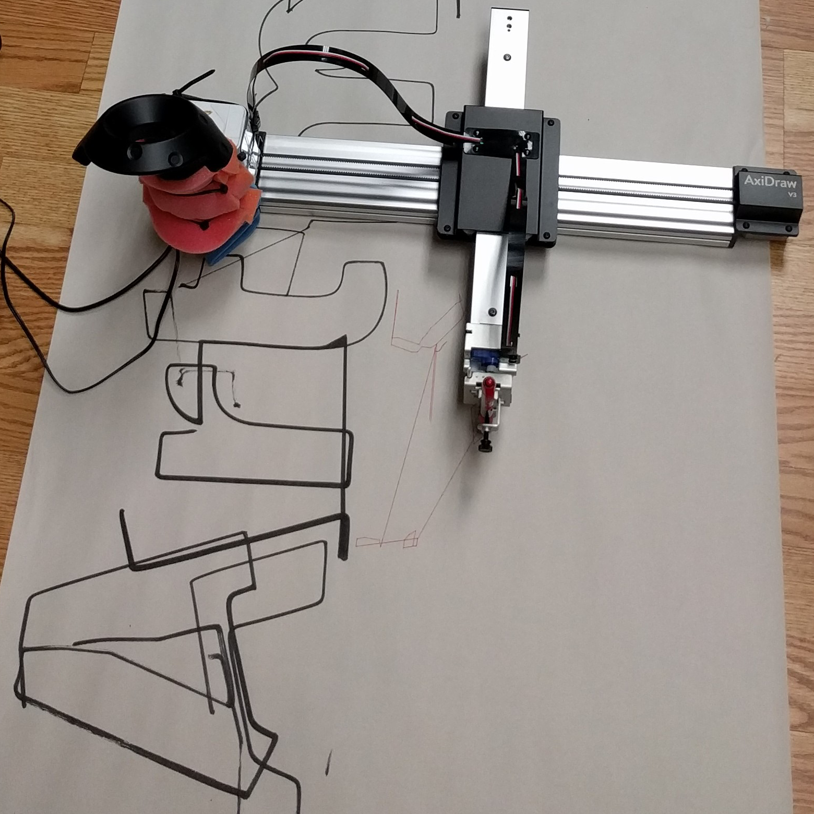
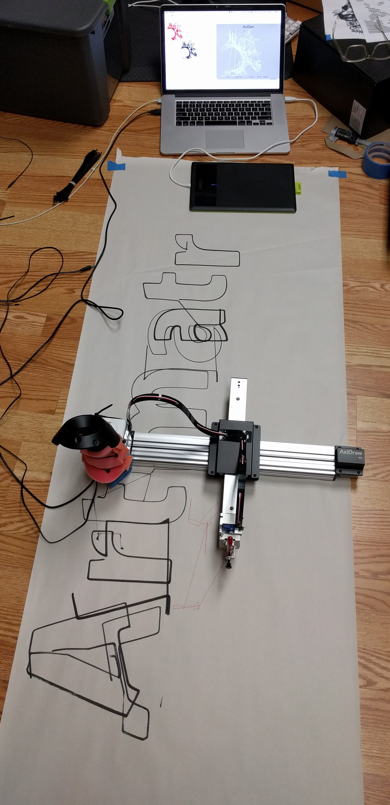

After I got an AxiDraw I wanted to combine it with the Vive tracking experiments I was doing at the
time. I had written a server in Unity <!-- TODO upload to GitHub and link it -->to broadcast the
tracking information from Vive controllers to other applications over UDP. So I wrote a simple web
application that took a vector image and sliced out an AxiDraw-sized region based on the location
of a Vive controller I crudely zip-tied to the plotter.

Sizing and placing the image in real space was a pain and I didn't have time to make that better so
I only did a few tests before shelving the project. To use it I would load the image and manually
tweak the code to scale and place it on my floor. Then I would pull the trigger on the Vive controller
to tell the application to send the commands for drawing the current slice of the image to the AxiDraw.
After plotting a region was finished I would move the machine and trigger it again.

A lot could be improved with this rough prototype. The accuracy of the output was much poorer than
the accuracy of the tracking because I didn't accurately map the virtual image region to the
machine space for the AxiDraw. As a result the lines at the edges of different regions didn't
completely meet. But overall I was happy that the basic principles were sound, and in later projects
at Artmatr and my robotics company, [Haploid](https://haploid.co), I extended the concept much further
with significantly more complicated machines.

You can find the code I wrote for slicing out portions of the image to be plotted, and the front-end
I used to display it, on GitHub: [jmptable/axidraw-mural-slicer](https://github.com/jmptable/axidraw-mural-slicer)

