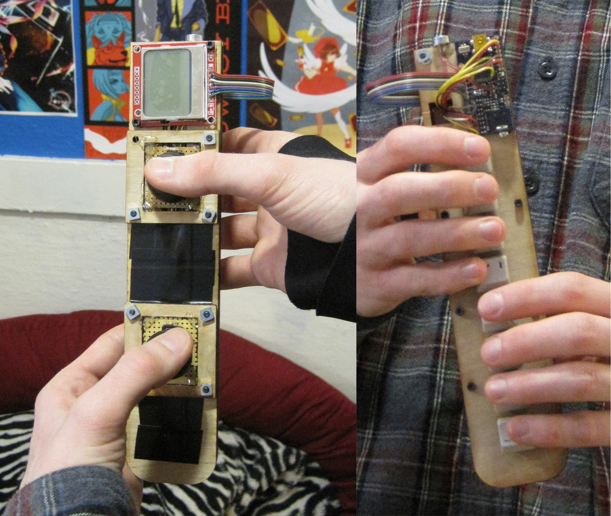
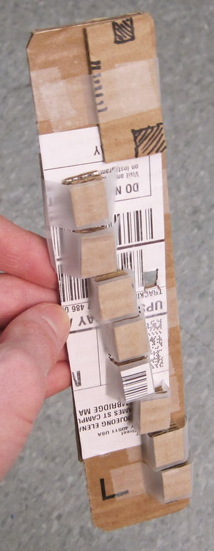
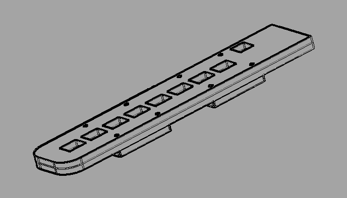
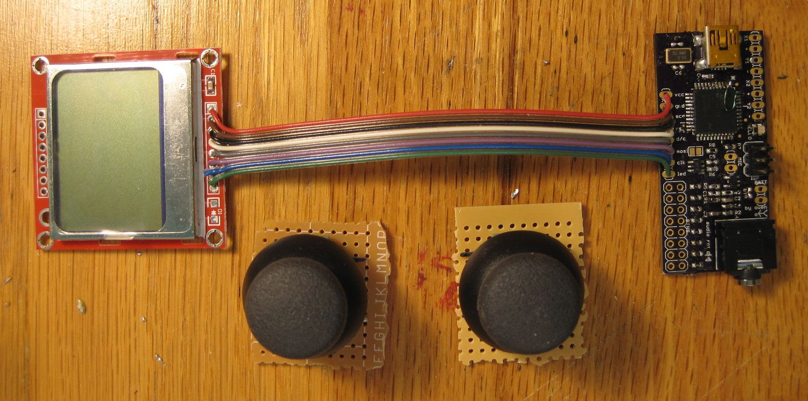

<!-- FIXME when was this? -->

Scratching a persistent itch to make things that make noise. Grapbloop was a synthesizer concept based on programmatic sample capture and manipulation. A chord keyboard on the back was meant for typing code that would manipulate sounds captured from a microphone. Two joysticks onboard were meant for expressive adjustment of arbitrary parameters defined in the code.

To figure out how to arrange all the parts I built a simple cardboard mockup that roughly matched the dimensions of the real parts. Then I designed some parts to be laser-cut in SolidWorks.

For the electronics I designed a control board based around an ATmega32u4. It could load programs and sample data via USB, host the audio scripting runtime, and synthesize sound via a DAC.

The audio runtime was the most challenging part. I wrote the code in assembly because I wanted complete control over the timing characteristics of the scheduler that decided when bits of script bytecode needed to run to generate the audio. Eventually the slow progress through that complexity killed the project after it had only managed to generate a few pained squawks.
