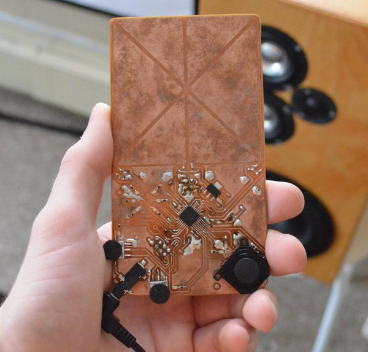

<!-- FIXME when was this? -->

Excited by music, augmented reality, and writing fiddly assembly on microcontrollers. Empowered by
a fresh ability to etch my own PCBs. I set out to create a new kind of synthesizer.

The Patch Synth was meant to be a digital [modular synthesizer](https://en.wikipedia.org/wiki/Modular_synthesizer).
Normally modular synths use patch cables to connect functional modules together to create new sounds.
The resulting crazy tangle of wires accounts for at lot of the fun of modular synths, along with the
physical interface made up of buttons, knobs, sliders, etc. However all of that makes those synths
quite large - definitely not something one could fit in a pants pocket.

I wanted to make a small digital synth I could carry around in my pocket that also captured some of
the fun of a full modular synthesizer. To me that meant maintaining the ability to modify the sound
using "patch cables" strung between "synth modules". I envisioned a device that could be place into
an augmented reality scene by tracking the location of a pattern on its surface. In augmented
reality the device could be enlarged to include bays for many virtual synth modules, and those could
be connected by virtual patch cables. The real device would have several physical inputs and a
physical audio output which could be connected to the virtual synth modules. So once a set of
modules were patched together in AR using a phone the device could be held and used to make music on
its own.

To get started I designed the device. I used an AVR microcontroller because I was most familiar with
those at the time. I included some thumb potentiometers, a flat joystick from a PSP, some LEDs, and
some pads for capacitive touch input. On the back there was space for two coin cell batteries and
space for a Bluetooth radio to connect the device to a phone. The device was divided into two
regions, one with most of the circuitry and controls, and the other with flat space for the
camera-trackable pattern.

For the pattern I generated a QR code which pointed to a website and put it inside a square black
border. The black border was meant to make the pattern easily tracked using computer vision and the
website the QR code linked to was destined to provide the AR application needed to patch together
the synth's modules.

I got as far as assembling the hardware for the first prototype and building a simple AR application
to show 3D graphics overlaid on the device through a phone. The etch for the PCB was not perfect and
there was a short somewhere on the board so I couldn't get the microcontroller to flash itself. It
ended up being great inspiration for later projects, and I am happy with how the visual design of the
PCB turned out. If I were to continue the project I would split the work into: 1) Creating and testing
the AR application. 2) Breadboarding the hardware for connecting to the phone, playing audio, and
reading inputs. 3) A finalized PCB design with everything integrated.

