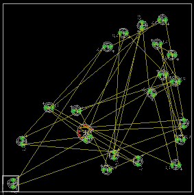
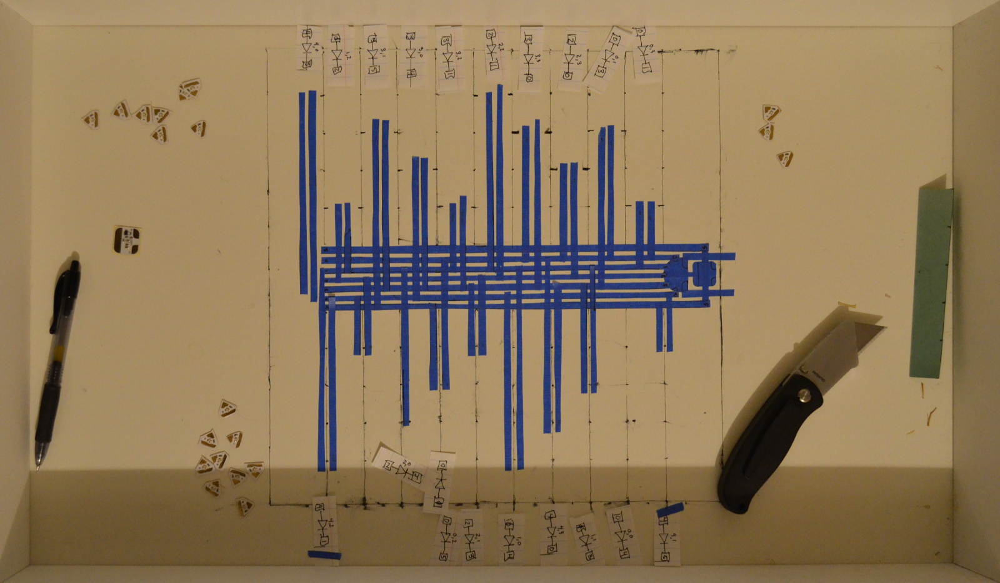
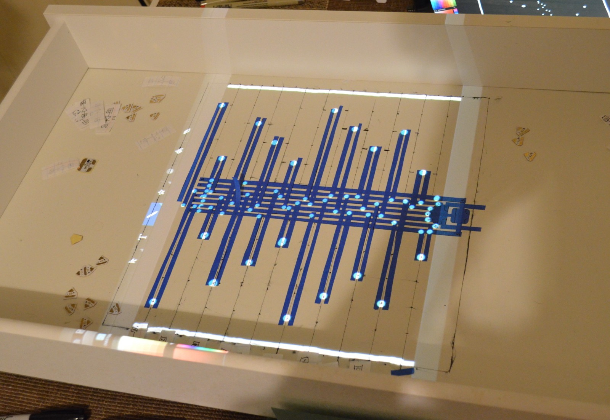

# Circuit Stickers

My friend Jie invented electronic stickers that can be put down on a surface and connected with copper tape to make blinky, crafty things that respond to the world in various ways. She sells them under the [Chibitronics](http://chibitronics.com/) name but they are also part of the research that she has done at the MIT Media Lab in the [Responsive Environments group](https://www.media.mit.edu/research/groups/responsive-environments). In December of 2015 she gave me and a few other artists the stickers and asked us to see what interesting things we could make with them.

# Charlieplexing

I started to explore what can be done with the stickers by implementing some basic microcontroller projects. One of the first designs I tried was a Charlieplexed array of white LED stickers. [Charlieplexing](https://en.wikipedia.org/wiki/Charlieplexing) is a technique for driving lots of LEDs from just a few wires. It relies upon the fact that LEDs behave like one-way electrical valves. When lighting a particular LED many others see a voltage but only the one gets it from the correct side to illuminate.

It was satisfying to use the stickers for this project because they let me lay out the actual circuit on top of the schematic that I initially drew with pen on paper. It was just a matter of putting copper tape down on top of the lines I drew for the wires, putting bits of electrical tape where they needed to cross over, and plopping LED stickers in-between. A little code for the microcontroller sticker was the last part.

There were a few quirks in the implementation. Only one LED should light up at a time, but if you look carefully you will see that extra ones light up a little bit around the LED that is really bright. I believe this was because the LEDs on the stickers are especially efficient and can make use of the tiny currents that the digital IO lines still sink and source when they are in high impedance mode (the mode they are in when set to be inputs).

I also noticed that after leaving the circuit alone for a day and then turning it back on, things did not work quite right. The adhesive on the copper tape is conductive but is not perfectly so and pieces must be pressed together strongly to establish a good connection. Over time the taped connections can fail as they relax. Jie’s recommendation is to solder connections on circuits that you want to keep around for a long time so that was the solution I used when it came to the final piece.

It was satisfying to use the stickers for this project because they let me lay out the actual circuit on top of the schematic that I initially drew with pen on paper. It was just a matter of putting copper tape down on top of the lines I drew for the wires, putting bits of electrical tape where they needed to cross over, and plopping LED stickers in-between. A little code for the microcontroller sticker was the last part. I wish I had had stickers
like these for my electrical engineering notes when I was in school. It would have been so cool to embed
the actual circuits I was writing about next to their descriptions.

There were a few quirks in my Charlieplexing implementation. Only one LED should light up at a time, but if you look carefully you will see that extra ones light up a little bit around the LED that is really bright. I believe this was because the LEDs on the stickers are especially efficient and can make use of the tiny currents that the digital IO lines still sink and source when they are in high impedance mode (the mode they are in when set to be inputs).

I also noticed that after leaving the circuit alone for a day and then turning it back on, things did not work quite right. The adhesive on the copper tape is conductive but is not perfectly so and pieces must be pressed together strongly to establish a good connection. Over time the taped connections can fail as they relax. Jie’s recommendation is to solder connections on circuits that you want to keep around for a long time so that was the solution I used when it came to the final piece.

# Trying Algorithmic Design

From the beginning I was convinced that this project would be an ideal opportunity for playing with algorithmic approaches to design. Sadly, I spun my wheels on several false starts and experiments that led nowhere. The work did not reach the final artwork directly, but at least it resulted in some interesting artifacts.

I mostly used the wonderful [Processing environment](https://processing.org/) to do the prototyping. My first attempt was a very simple program that assumed the resulting artwork would be made of only vertical or horizontal copper strips, because it seemed like that would optimize the fabrication difficulty and code complexity. The program stored a grid of cells where each cell knew whether it contained a vertical or horizontal portion of tape. I calculated the size of the grid by measuring how many strips of tape could sit next to one-another on the 12" x 12" canvas that the final piece would use.

After running the program the for the first time with the cells in random states I saw a complex maze-like pattern that would have to take days to fabricate by hand. To make it work I would need to tell the code to optimize for ease-of-fabrication while wrapping an interesting circuit into the pattern. At the time that seemed like too much work so I started thinking about where I could find code that already knows how to do circuit layout. Then it hit me that CAD software for designing PCBs almost always includes automatic routing of a circuit given a layout of its parts and maybe I could just hack on that to get what I wanted.

I am most familiar with Eagle so I chose it as the CAD program I would target. As the first step I made the schematic for the 4x5 Charlieplexed LED array. Then I designed a rough footprint for the microcontroller sticker and switched to the PCB layout view. In Processing I used *java.awt.Robot* to send keypresses telling Eagle to move a random LED to a random location. Then I sent control-s to save the board file. After parsing the board file (which is pretty easy because the format is based on XML) I scored the design by counting the number of times that airwires overlapped. The more overlaps there were the worse I considered the design, because every one of them would mean a piece of electrical tape to prevent short-circuiting.

It was neat to watch the computer use Eagle on its own but after spending a long time handling timing problems (losing keypresses because they were too close together) and trying to deal with other frustrating edge cases I lost steam. So I went back to Processing and worked on a slightly more manual algorithmic layout program.

This one was still based on Charlieplexing LEDs, but it added a bus to the middle to help simplify the problem of circuit layout. I was hoping that by randomizing the distance of the LEDs from the bus I could find pleasing patterns with almost uniform distribution of the LEDs across the canvas. Unfortunately it seemed that 20 LEDs in the array (the most I could have using the 5 I/O available on the microcontroller) was just too few to make the eye see noise instead of look for geometric patterns.

I made a stab at manually laying out a more pleasing circular-bus-based design in Eagle but quickly became frustrated because it was so painful to get concentric circles with the arc tool.

Running out of time before the final deadline I made the decision to simplify further. With some cardboard covered in painters tape as a background I played with the arrangement of the actual stickers until I found something interesting.

I straightened the bus and settled on a symmetric layout of LEDs. The symmetry looked nicer than the noise-based layouts I had played with earlier and it helped make the design easier to fabricate correctly. On paper I worked out how each LED should connect to the bus based on the schematic I previously made in Eagle.

Intimidated by the immaculate 12x12 white canvas I intended to use as the artwork’s final substrate I set out to make a one-to-one draft of my design before transferring it in final form onto the canvas. I grabbed an unused desk drawer, an old laptop, a utility knife, markers, and a roll of painter’s tape.

Using the back of the laptop as a cutting surface (after adding “actual cutting mats” to my shopping list) I laid out painters tape and cut it into strips roughly the width of the copper tape that Jie gave me. I did not want to use the actual copper tape for the draft because I doubted I could peel it off cleanly, my supply was not very large, and it is pretty expensive stuff. Took an hour of painstaking work with the knife but at the end I had a good stand-in for the copper.

I put down the 5 lines of the bus, an outline of the microcontroller sticker, and an outline of the light sensor sticker. Then I measured a one inch grid and marked it on the surface of the drawer. Laying LED stickers on the grid I tried out many different arrangements. Noisy designs didn’t work because the straight lines of the grid force the eye to try to find patterns. Lots of obvious symmetric designs looked silly by being too simplistic, like profiles of sine, sawtooth, or triangle waves. I tried to chop up the profile and as a result got a sort of interlaced pine tree.

After getting comfortable with the draft of the design I set out to transfer it over to the canvas. In the recent past I have played with projection mapping, so every problem must be solved with projection mapping. I built a rig over the table to hold a laser pico projector in place. Then I hooked it up to my tablet and opened a drawing app. I traced the key points of the design in light and then removed the drawer.

Once I had the canvas at the right location, orientation, and height I started tracing under the light with copper and circuit stickers.

The process was not completely smooth because the canvas was easily nudged out of alignment with the projector, but the basic principle was sound.

Final changes included adding the light sensor on the side opposite the microcontroller, trimming the tape for neatness, soldering the tape connections to make them permanent, and, of course, writing the firmware to make it actually do something.

The website Jie put together for all the art and her awesome thesis is [here on the Media Lab website](http://papercuriosities.media.mit.edu/).

# Behavior

Yellow and red LEDs flash more or less sporadically depending on the amount of light. I sampled the light sensor from one of the microcontroller pins already used by the LEDs by setting all IO pins to be inputs and then reading the analog voltage on the pin with the internal ADC. That value then determined how rapidly a basic pseudo-random number generator was sampled. The random values determined whether each LED was on or off in a particular moment of time, resulting in a flickering effect. Most other patterns would not work very well because the light sensor was capable of driving some of the LEDs a bit, so even with Charlieplexing the LEDs could not be set to perfect arbitrary patterns.

