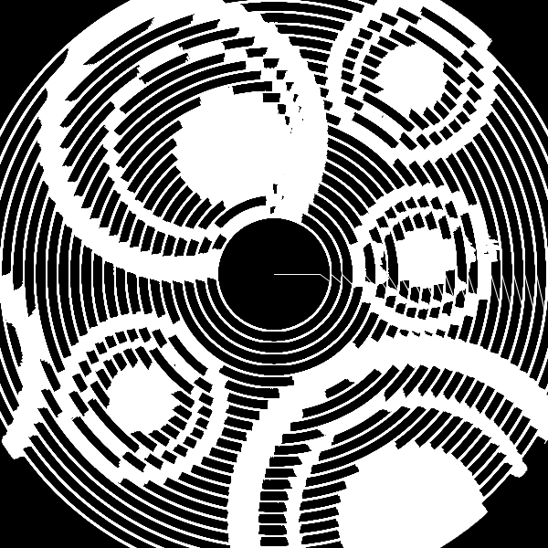
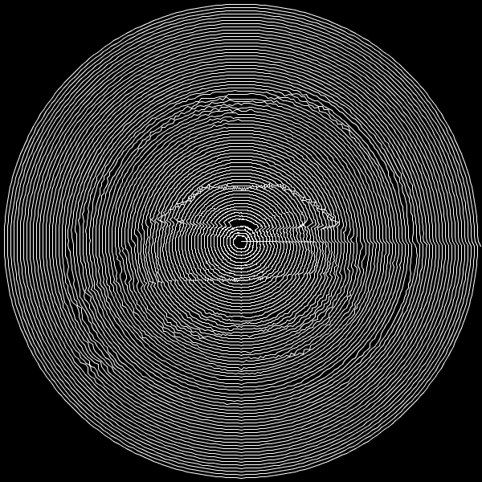
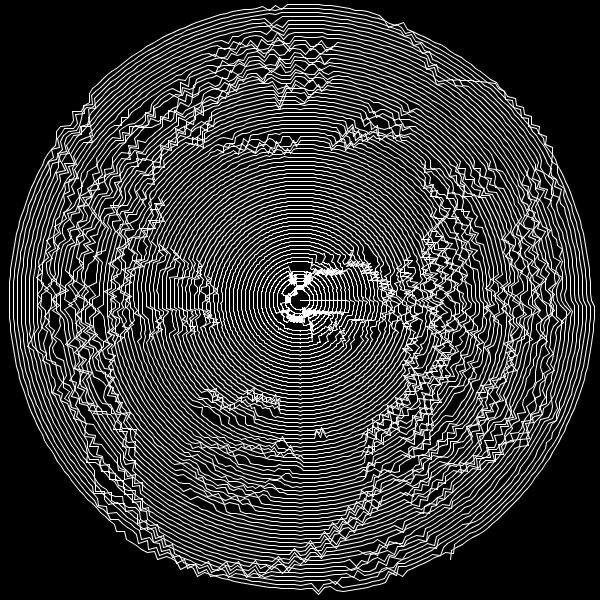
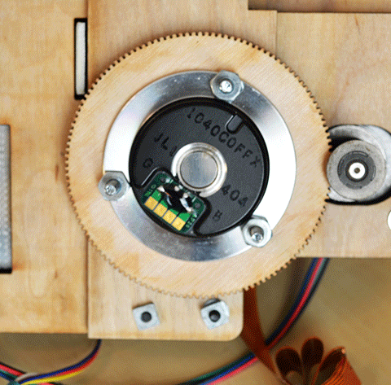

<!-- FIXME when was this? -->

Imagine a pen that, when laid flat on its side on a surface, spins on its own in a circle around its tip while laying down ink to form an image. It would be a very versatile graffiti tool, allowing digital imagery to be mixed with hand-drawn work. With current technology what we might hope for instead is just a more portable plotter.

What I built was much larger than a pen, but I was hoping that it could still be refined into a versatile tool. The arm rotated above the magnetic base (duct-taped to a non-magnetic floor in the image...) thanks to a stepper motor that was coupled to a large laser-cut gear. To move the pen the arm from a more conventional plotter was adapted. For control it had an Arduino board with BLE so that it could communicate with phones and computers wirelessly.

To generate the control commands for the motors I wrote a simple piece of code that traced a spiral across digital images, deviating the line more or less depending on the brightness of the pixel below that point of the spiral.

<!-- TODO link to the code -->

