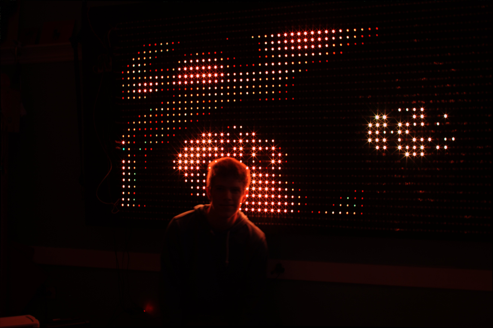

<iframe src="https://player.vimeo.com/video/119031210" width="640" height="360" frameborder="0" webkitallowfullscreen mozallowfullscreen allowfullscreen></iframe>

<a href="https://vimeo.com/119031210">squarepusher</a> from <a href="https://vimeo.com/owentrueblood">Owen Trueblood</a> on <a href="https://vimeo.com">Vimeo</a>.

 

## Driving an LED Array from Shaders Running on a Raspberry Pi

The Very Large LED Array, or VLLA for short, is a bunch of LEDs mounted on a 4x8'
sheet of plywood driven by two Teensy microcontrollers and a Raspberry Pi. The
hardware was designed and [constructed by friends of mine](https://e2e.ti.com/group/universityprogram/students/m/students_repository/664650)
for our hall in our dorm at MIT with funding from Texas Instruments. The goal was
to create an impressive light show for parties.

I was interested in the software driving the display and had a desperate need to
obsess over something not school related at the end of my 2nd semester in my
junior year, so I developed a series of tools for creating effects for the display.
In its final form the system could run effects written in JavaScript or Lua, piped
frame-by-frame over UDP, read from GIFs, or streamed from pixels on a Linux desktop.

<iframe src="https://player.vimeo.com/video/117706820" width="640" height="360" frameborder="0" webkitallowfullscreen mozallowfullscreen allowfullscreen></iframe>

<a href="https://vimeo.com/117706820">doctor</a> from <a href="https://vimeo.com/owentrueblood">Owen Trueblood</a> on <a href="https://vimeo.com">Vimeo</a>.

 

<iframe src="https://player.vimeo.com/video/117706817" width="640" height="360" frameborder="0" webkitallowfullscreen mozallowfullscreen allowfullscreen></iframe>

<a href="https://vimeo.com/117706817">madeon</a> from <a href="https://vimeo.com/owentrueblood">Owen Trueblood</a> on <a href="https://vimeo.com">Vimeo</a>.

 

<iframe src="https://player.vimeo.com/video/119031212" width="640" height="360" frameborder="0" webkitallowfullscreen mozallowfullscreen allowfullscreen></iframe>

<a href="https://vimeo.com/119031212">flutebox</a> from <a href="https://vimeo.com/owentrueblood">Owen Trueblood</a> on <a href="https://vimeo.com">Vimeo</a>.

 

<iframe src="https://player.vimeo.com/video/119031211" width="640" height="360" frameborder="0" webkitallowfullscreen mozallowfullscreen allowfullscreen></iframe>

<a href="https://vimeo.com/119031211">roland</a> from <a href="https://vimeo.com/owentrueblood">Owen Trueblood</a> on <a href="https://vimeo.com">Vimeo</a>.

 

<iframe src="https://player.vimeo.com/video/117706819" width="640" height="360" frameborder="0" webkitallowfullscreen mozallowfullscreen allowfullscreen></iframe>

<a href="https://vimeo.com/117706819">cats-on-mars</a> from <a href="https://vimeo.com/owentrueblood">Owen Trueblood</a> on <a href="https://vimeo.com">Vimeo</a>.

 

<iframe src="https://player.vimeo.com/video/117706818" width="640" height="360" frameborder="0" webkitallowfullscreen mozallowfullscreen allowfullscreen></iframe>

<a href="https://vimeo.com/117706818">beats-around-madison</a> from <a href="https://vimeo.com/owentrueblood">Owen Trueblood</a> on <a href="https://vimeo.com">Vimeo</a>.

 

## Rotating a Panda

<iframe src="https://player.vimeo.com/video/110753715" width="640" height="360" frameborder="0" webkitallowfullscreen mozallowfullscreen allowfullscreen></iframe>

<a href="https://vimeo.com/110753715">Panda LED Effect Demo</a> from <a href="https://vimeo.com/owentrueblood">Owen Trueblood</a> on <a href="https://vimeo.com">Vimeo</a>.

 

One of the first effects I developed for the VLLA was directly inspired by a
loading screen in a demo by Fairlight called We Are New. In the demo a
pistol-wielding panda rendered in chunky volumetric form rotated in 3D space.

You can find my code to recreate the effect below:

 

<iframe width="560" height="315" src="https://www.youtube.com/embed/L8onlB0F1_A?rel=0&amp;start=311" frameborder="0" allow="autoplay; encrypted-media" allowfullscreen></iframe>
